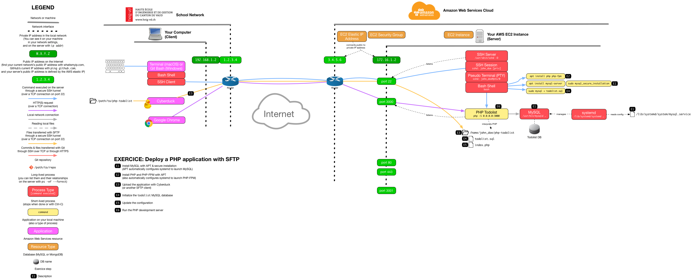

# Deploy a PHP application with SFTP

This guide describes how to deploy a PHP application over SFTP on a server with PHP and MySQL installed,
using the PHP development server.

<!-- START doctoc generated TOC please keep comment here to allow auto update -->
<!-- DON'T EDIT THIS SECTION, INSTEAD RE-RUN doctoc TO UPDATE -->


- [Setup](#setup)
  - [Install MySQL](#install-mysql)
  - [Install PHP](#install-php)
- [Upload the application](#upload-the-application)
- [Initialize the database](#initialize-the-database)
- [Update the configuration](#update-the-configuration)
- [Run the PHP development server](#run-the-php-development-server)

<!-- END doctoc generated TOC please keep comment here to allow auto update -->


## Setup

Use the previous PHP Todolist Exercice.
Clone the [PHP Todolist Exercice][php-todolist] on your machine if you do not have it.

### Install MySQL

Update your package lists and install the MySQL database server:

```bash
$> sudo apt update

$> sudo apt install mysql-server
```

APT should automatically run MySQL after installation.
You can check this with the following command:

```bash
$> sudo systemctl status mysql
```

Secure your installation:

```bash
$> sudo mysql_secure_installation

Securing the MySQL server deployment.

Connecting to MySQL using a blank password.

VALIDATE PASSWORD PLUGIN can be used to test passwords
and improve security. It checks the strength of password
and allows the users to set only those passwords which are
secure enough. Would you like to setup VALIDATE PASSWORD plugin?

Press y|Y for Yes, any other key for No: y

There are three levels of password validation policy:

LOW    Length >= 8
MEDIUM Length >= 8, numeric, mixed case, and special characters
STRONG Length >= 8, numeric, mixed case, special characters and dictionary file

Please enter 0 = LOW, 1 = MEDIUM and 2 = STRONG: 2
Please set the password for root here.

New password: ***
Re-enter new password: ***

Estimated strength of the password: 100
Do you wish to continue with the password provided?(Press y|Y for Yes, any other key for No) : y

By default, a MySQL installation has an anonymous user,
allowing anyone to log into MySQL without having to have
a user account created for them. This is intended only for
testing, and to make the installation go a bit smoother.
You should remove them before moving into a production
environment.

Remove anonymous users? (Press y|Y for Yes, any other key for No) : y
Success.

Normally, root should only be allowed to connect from
'localhost'. This ensures that someone cannot guess at
the root password from the network.

Disallow root login remotely? (Press y|Y for Yes, any other key for No) : y
Success.

By default, MySQL comes with a database named 'test' that
anyone can access. This is also intended only for testing,
and should be removed before moving into a production
environment.

Remove test database and access to it? (Press y|Y for Yes, any other key for No) : y
 - Dropping test database...
Success.

 - Removing privileges on test database...
Success.

Reloading the privilege tables will ensure that all changes
made so far will take effect immediately.

Reload privilege tables now? (Press y|Y for Yes, any other key for No) : y
Success.

All done!
```

### Install PHP

Here you will install the bare minimum:

* The PHP FastCGI process manager.
* The PHP MySQL extension.

Simply run this command to install both:

```bash
$> sudo apt install php-fpm php-mysql
```


## Upload the application

Use an SFTP client like [Cyberduck][cyberduck] to upload the application to the server.


## Initialize the database

Go into the uploaded directory on the server:

```bash
$> hostname
my-name.archidep-2018.media

$> cd /path/to/uploaded/application
```

Execute the project's SQL file to create the database and table:

```bash
$> sudo mysql < todolist.sql
```


## Update the configuration

Update the first few lines of the `index.php` file with the correct configuration:

```php
define('BASE_URL', '/');
define('DB_USER', 'todolist');
define('DB_PASS', 'chAngeMeN0w!');
define('DB_NAME', 'todolist');
define('DB_HOST', '127.0.0.1');
define('DB_PORT', '3306');
```


## Run the PHP development server

Also in the uploaded directory on the server, run a PHP development server on port 3000:

```bash
$> php -S 0.0.0.0:3000
```

You should be able to access the application in a browser at the correct IP address and port (e.g. `1.1.1.1:3000`).


## End result



> [PDF version](sftp-deployment.pdf).


[cyberduck]: https://cyberduck.io
[php-todolist]: https://github.com/MediaComem/comem-archidep-php-todo-exercise
