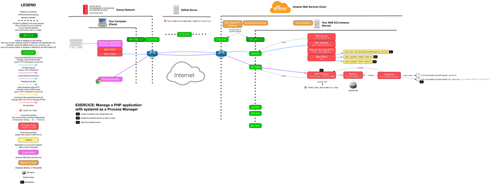

# Manage a PHP application with systemd as a Process Manager

This guide describes how to create a [systemd][systemd] service to run the PHP application.

<!-- START doctoc generated TOC please keep comment here to allow auto update -->
<!-- DON'T EDIT THIS SECTION, INSTEAD RE-RUN doctoc TO UPDATE -->


- [Setup](#setup)
- [Create a systemd unit configuration file](#create-a-systemd-unit-configuration-file)
- [Enable and start the todolist service](#enable-and-start-the-todolist-service)
- [Reboot and try again](#reboot-and-try-again)

<!-- END doctoc generated TOC please keep comment here to allow auto update -->


## Setup

Make sure you have done the [previous exercise](config-through-environment.md).

Stop your `php -S` command if it is still running.


## Create a systemd unit configuration file

Copy the following configuration, replacing the following values:

* Replace `john_doe` by your username on your server.
* Replace `/home/john_doe` by your home directory on your server.

```
[Unit]
Description=PHP TodoList

[Service]
ExecStart=/usr/bin/php -S 0.0.0.0:3000
User=john_doe
WorkingDirectory=/home/john_doe/todolist-repo
Environment=TODOLIST_DB_PASS=chAngeMeN0w!

[Install]
WantedBy=mysql.service
```

Save it to `/etc/systemd/system/todolist.service` on the server.

> You can edit this file with `nano` on the server with the following command:
> `sudo nano /etc/systemd/system/todolist.service`.


## Enable and start the todolist service

Enable and start your new service:

```bash
$> sudo systemctl enable todolist
$> sudo systemctl start todolist
```

Make sure it is running:

```bash
$> sudo systemctl status todolist
```

You should be able to access the running todolist application in your browser on your server's IP address and port 3000.


## Reboot and try again

Reboot your server:

```bash
$> sudo reboot
```

The todolist application should still be running:

```bash
$> sudo systemctl status todolist
```


## End result



> [PDF version](systemd-deployment.pdf).


[systemd]: https://en.wikipedia.org/wiki/Systemd
